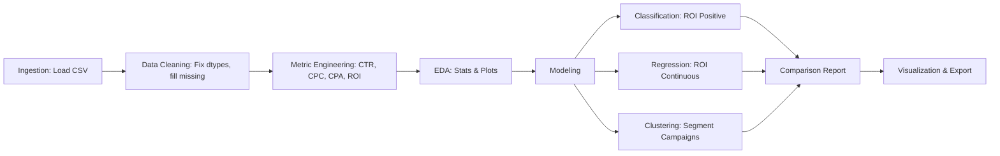

---

# 📊 Marketing Campaign Analytics Pipeline

## 🔹 Overview

This project implements a full-stack marketing campaign analytics pipeline in Python. The goal is to transform raw campaign datasets impressions, clicks, conversions, costs, engagement metrics into **actionable insights** that drive marketing decisions.

The pipeline supports,

* Data ingestion & cleaning Handles missing or inconsistent columns e.g., Spend, Revenue.
* Metric engineering Calculates campaign KPIs such as CTR, CPC, CPA, and ROI.
* Exploratory Data Analysis EDA Summarizes campaign performance with plots and statistics.
* Predictive modeling:

  * Classification → Predicts whether ROI will be positive.
  * Regression → Predicts ROI as a continuous value.
  * Clustering → Segments campaigns into interpretable groups.
* Reporting: Generates tables, model comparisons, and cluster profiles with labels like *“High ROI – Low Cost”*.

---

## 🔹 Motivation

Marketing teams often struggle to:

* Identify high-performing vs underperforming campaigns.
* Optimize budget allocation** across channels.
* Predict campaign success before committing spend.
* Understand behavioral segments of campaigns.

This project bridges the gap by providing:

* A **reliable, reproducible pipeline** for campaign analytics.
* Multiple modeling strategies **classification, regression, clustering** for different business questions.
* **Automated visualizations and reports** for easy interpretation.

---

## 🔹 Dataset

The project works with a **marketing campaign dataset** CSV format. Columns include:

* **Impressions** → Number of times an ad was shown.
* **Clicks** → User clicks on the ad.
* **Conversions** → Completed actions purchases, signups, etc..
* **Spend / Cost / Budget** → Amount spent on ads.
* **Revenue** → Campaign returns if available.
* **Engagement scores** or other platform-specific metrics.

If **Spend or Revenue** are missing, the pipeline estimates them using **conversion rates, acquisition cost, ROI, or CPC**.

---

## 🔹 Key Metrics

* **CTR Click-Through Rate** = Clicks ÷ Impressions
* **CPC Cost Per Click** = Spend ÷ Clicks
* **CPA Cost Per Acquisition** = Spend ÷ Conversions
* **ROI Return on Investment** = Revenue – Spend ÷ Spend

These KPIs form the foundation for analysis, modeling, and clustering.

---

## 🔹 Project Workflow



---

## 🔹 Modeling

### 1. **Classification**

* Target: `ROI > threshold` binary.
* Algorithms: Logistic Regression, Random Forest, Gradient Boosting.
* Metrics: Accuracy, F1 Score, AUC.

### 2. **Regression**

* Target: `ROI` continuous.
* Algorithms: Linear Regression, Random Forest Regressor, Gradient Boosting Regressor.
* Metrics: MAE, RMSE, R².

### 3. **Clustering**

* Features: CTR, CPC, CPA, ROI.
* Method: KMeans with silhouette-based selection of *k*.
* Outputs: Cluster assignments + **profiles with auto-labels** e.g., *“High ROI – Low Cost”*.

---

## 🔹 Outputs

* **Processed dataset** → saved as `.parquet` for downstream use.
* **EDA plots** → Distributions of CTR, CPC, CPA, ROI.
* **Model artifacts** → Trained classifiers/regressors saved as `.joblib`.
* **Cluster profiles** → Summaries of each segment with KPIs.
* **Comparison report** → Table + bar chart comparing classification, regression, and clustering performance.

---

## 🔹 Example Results

| Approach            | Metrics                           |
| ------------------- | --------------------------------- |
| Classification | Accuracy=0.84, F1=0.85, AUC=0.83  |
| Regression    | MAE=8.50, RMSE=12.11, R²=0.61     |
| Clustering    | Silhouette=0.47, Profiles labeled |

📊 Visuals include:

* Scatterplots ROI vs CPC, colored by cluster.
* Pairplots ROI, CTR, CPC, CPA by cluster.
* Distribution plots for KPIs.

---

## 🔹 Tech Stack

* **Python 3.9+**
* **Pandas / NumPy** → Data wrangling
* **Scikit-learn** → Modeling, clustering, evaluation
* **Matplotlib / Seaborn** → Visualization

---

## 🔹 Usage

1. Clone the repo and install dependencies:

2. Run the pipeline:

   ```bash
   python marketing_campaign_pipeline.ipynb
   ```

## 🔹 Next Steps

* Add **time-series analysis** to track ROI trends over time.
* Integrate with **dashboards Streamlit / Plotly Dash** for interactive analytics.
* Deploy models with **MLflow** for experiment tracking.
* Extend clustering to incorporate **text features** ad copy sentiment, channel tags.

---

## 🔹 Conclusion

This project provides a **robust, interpretable, and extensible framework** for analyzing marketing campaign data. By combining **predictive modeling and unsupervised clustering**, it equips marketing teams with the insights needed to:

* Identify high-value campaigns,
* Reduce wasted spend,
* And make **data-driven budget allocation decisions**.

---
